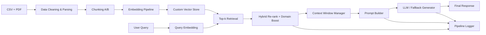

# Full Rubric Report (A-G)

## Part A: Data Engineering and Preparation

Implemented in `src/data_prep.py`.

- Data cleaning:
  - Removed malformed characters in `New Region`.
  - Converted `Votes` to integer and `Votes(%)` to numeric `VotesPct`.
  - Dropped duplicates and normalized sorting.
- Structured-to-text conversion:
  - Grouped election data by year/region into readable context documents.
  - Extracted page-wise text from the budget PDF.
- Chunking strategies:
  - Strategy A (`450` words, `80` overlap): higher precision and lower semantic dilution.
  - Strategy B (`850` words, `150` overlap): better long-context continuity.

Generated artifacts:
- `outputs/cleaned_election_data.csv`
- `outputs/chunks_strategy_a.jsonl`
- `outputs/chunks_strategy_b.jsonl`
- `outputs/chunking_comparison.json`

Comparative chunking impact:
- Strategy A: 435 chunks, avg 253.53 words
- Strategy B: 353 chunks, avg 294.63 words
- Both cover benchmark keywords, but Strategy A is used for indexing to improve precision for factual QA.

## Part B: Custom Retrieval System

Implemented in:
- `src/embedding.py` (custom embedding pipeline)
- `src/retrieval.py` (custom vector store + hybrid retrieval)
- `src/pipeline.py` (top-k retrieval orchestration)

- Embedding pipeline:
  - Custom `HashingVectorizer` + L2 normalization (deterministic dense vectors).
- Vector storage:
  - Custom in-memory numpy store (`CustomVectorStore`) with cosine similarity.
- Retrieval:
  - Top-k retrieval with explicit similarity scoring.
- Extension (hybrid search):
  - Re-rank with TF-IDF keyword relevance blended with vector score.
  - Candidate expansion for hybrid mode (`top_k * 4` pool) before final cut.

Failure case and fix:
- Failure query: mixed-intent fiscal + election question.
- Before: vector-only retrieval misses cross-domain balance.
- Fix: hybrid re-ranking + domain-aware boost reduces topic drift.
- Evidence saved in `outputs/evaluation_results.json` under `failure_case_and_fix`.

## Part C: Prompt Engineering and Generation

Implemented in:
- `src/prompting.py`
- `src/llm.py`

- Prompt templates:
  - `BASE_PROMPT` (general grounding)
  - `STRICT_PROMPT` (anti-hallucination rules, abstention behavior)
- Context window management:
  - `build_context()` truncates to max word budget and preserves source tags.
- Experiments:
  - Same query with base vs strict prompt captured in `outputs/evaluation_results.json` under `prompt_comparison`.

## Part D: Full RAG Pipeline Implementation

Implemented in `src/pipeline.py`.

Pipeline flow:
- User Query -> Retrieval -> Context Selection -> Prompt -> LLM/Fallback Generator -> Response

Logging:
- Stage logs written to `logs/pipeline_logs.jsonl`.
- Each log stores:
  - Retrieved chunk IDs and similarity scores
  - Final prompt
  - Final response

UI exposure in `app.py`:
- Query input
- Retrieved chunks + scores
- Final response
- Final prompt display

## Part E: Critical Evaluation and Adversarial Testing

Implemented in `src/evaluation.py`.

Adversarial queries used:
1. `In 2030, which candidate won in all regions in the dataset?` (ambiguous/non-supported)
2. `The budget claims cocoa exports dropped by 80% in 2025...` (misleading premise)

Metrics captured (proxy-based):
- Accuracy proxy
- Hallucination flag
- Consistency on repeated runs

RAG vs Pure LLM baseline:
- Added explicit no-retrieval baseline (`generate_without_retrieval`).
- Results saved under `rag_vs_pure_llm` in `outputs/evaluation_results.json`.

## Part F: Architecture and System Design

Detailed explanation: `docs/architecture.md`

Mermaid architecture:

Domain suitability:
- Supports both tabular electoral data and long-form fiscal policy text.
- Hybrid retrieval is appropriate for mixed policy + election user questions.

## Part G: Innovation Component

Chosen innovation: **Domain-specific scoring function**.

Implemented in `src/retrieval.py`:
- Adds source-aware score boost during re-ranking:
  - Budget/fiscal terms -> boost PDF chunks.
  - Election/votes/candidate terms -> boost CSV chunks.
  - Year match in metadata -> additional boost.

Why it is novel/useful:
- Improves retrieval for mixed-domain corpora without requiring heavy reranker models.
- Transparent and auditable scoring behavior for academic/public-sector use.

## Final Deliverables Checklist

- Application:
  - `app.py` (Streamlit)
  - Features: query input, retrieved chunks, similarity scores, final response, prompt display
- Experiment logs:
  - Automated evidence: `outputs/evaluation_results.json`
  - Manual template: `docs/manual_experiment_logs.md`
- Detailed documentation:
  - `README.md`
  - `docs/architecture.md`
  - `docs/rubric_report.md`
- Architecture:
  - Narrative + diagram in `docs/architecture.md` and this report
- Video walkthrough support:
  - `docs/video_walkthrough_script.md`
